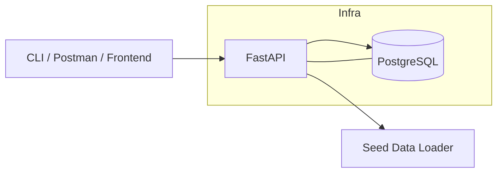
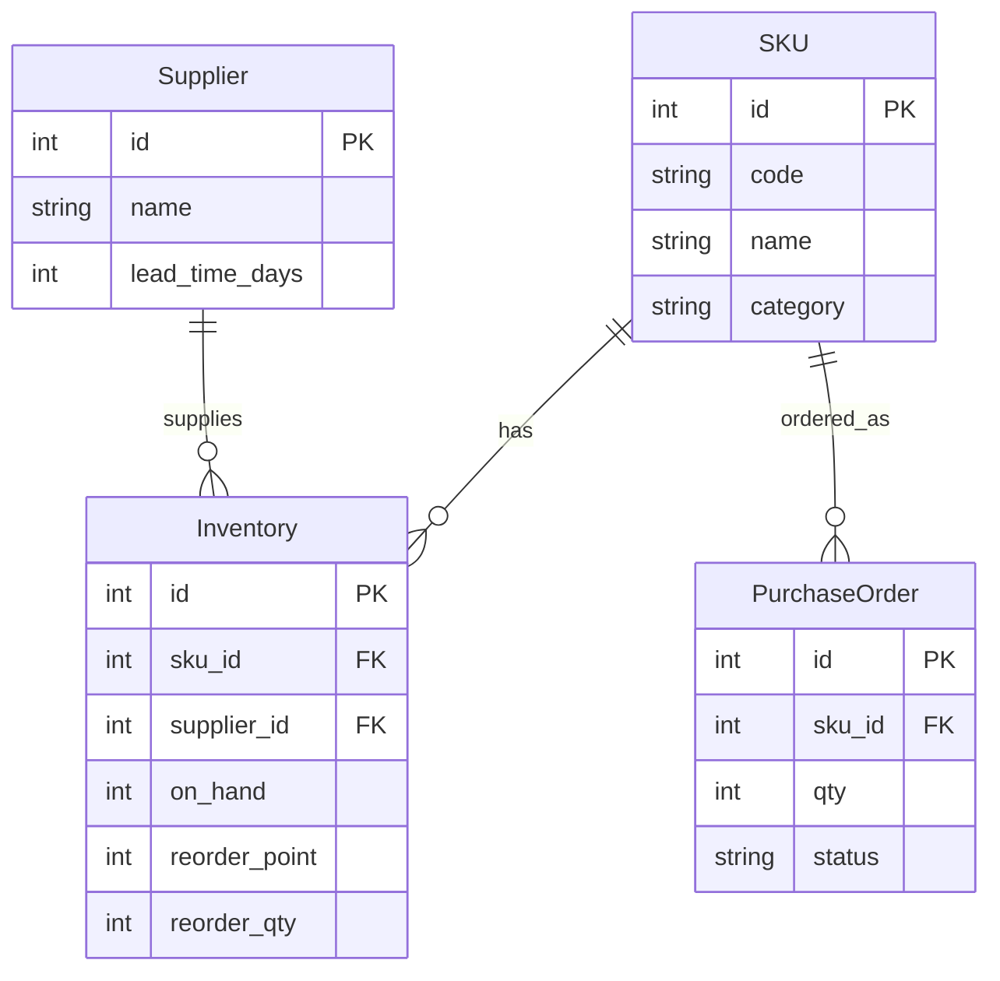

# Warehouse AI Suite (v1)
[](#)
[](#)
[](#)

Production-grade backend for warehouse inventory intelligence.

- **Stack:** FastAPI + SQLAlchemy 2.0 + Alembic + PostgreSQL + Docker Compose
- **Features:** CRUD for SKUs, Suppliers, Inventory, Purchase Orders; low-stock alerts; seed data
- **Quality:** GitHub Actions CI (pytest), Makefile, Postman collection, ASCII-safe docs
- **Live Docs:** `http://localhost:8000/docs` (after launch)

---

## Architecture (Mermaid)


---

## Quickstart
```bash
# 0) Prepare env
cp backend/.env.example backend/.env

# 1) Run stack
docker compose -f infra/docker-compose.yml up -d --build

# 2) Init DB
docker compose -f infra/docker-compose.yml exec api alembic upgrade head

# 3) Seed demo data
docker compose -f infra/docker-compose.yml exec api python -m app.seed.seed_demo

# 4) Verify
curl http://localhost:8000/health
curl http://localhost:8000/api/v1/skus
curl http://localhost:8000/api/v1/inventory/alerts/low-stock
```

OpenAPI: `http://localhost:8000/docs`

---

## Domain Model


---

## API Overview
- `GET /health` -> service status
- `GET /api/v1/skus` -> list SKUs
- `POST /api/v1/skus` -> create SKU
- `GET /api/v1/inventory/alerts/low-stock` -> items at/below reorder point
- More routes: suppliers, purchase_orders

See `docs/postman_collection.json` for ready-to-run requests.

---

## Makefile
```bash
make up           # build and run
make down         # stop
make logs         # follow API logs
make migrate msg="add table"
make upgrade      # alembic upgrade head
make seed         # load demo data
make test         # run pytest (in container)
```

---

## Tests
Minimal smoke test ready. Extend with:
- API tests (httpx, testcontainers optional)
- Model constraints and validation
- Seed and migration invariants

---

## Roadmap
- v1 (this): backend complete and demoable
- v2: Next.js dashboard, live alerts via WebSocket, replenishment optimizer (OR-Tools)
- v3: ML forecasting pipeline, metrics and reports

---

## License
MIT

---

## Demo Preview
> Add these files to `docs/screenshots/` to display previews on GitHub.


